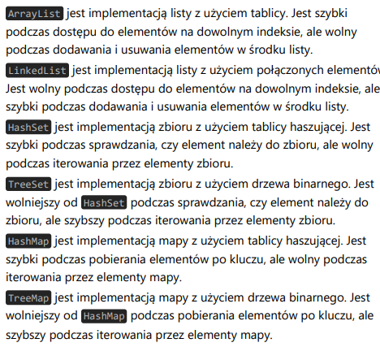

# Wyjątki, Kolekcje

### Wyjątki
Błędy wykonania programu są sygnalizowane z wykorzystaniem
obiektów __(Throwable)__. Klasa Throwable posiada dwie klasy potomne:
wyjątki __(Exception)__, błędy __(Error)__.
Wśród wyjątków znajduje się jedna szczególna klasa:
`RuntimeException`, określająca błędy pojawiające się w trakcie
działania programu, których nie można było łatwo przewidzieć na
etapie tworzenia oprogramowania np. `NullPointerException` lub
`IndexOutOfBoundsException`.

Obsługa pozostałych wątków jest obowiązkowa, tzn. jeżeli
korzystamy z metody mogącej zwrócić wyjątek musimy wykonać jedną
z dwóch czynności: obsłużyć wyjątek za pomocą `try..catch..(finally..)` lub zadeklarować, że nasza metoda może zwrócić wyjątek: `public void aMethod() throws FileNotFoundException{...}`.

Możemy "catchować" więcej niż tylko jeden wyjątek, wystarczy więcej instrukcji `catch` napisać lub w drugim przypadku po przecinku napisać kolejny wyjątek.
Od Javy 7 możliwe łączenie obsługi:
`catch(FileNotFoundException | NullPointerException ex)`

### Błędy

Błędy informują o nieprawidłowym działaniu Wirtualnej Maszyny Javy
(np. __OutOfMemoryError__). Aplikacja nie powinna próbować ich
obsługiwać, gdyż zwykle nie są one wynikiem nieprawidłowego jej
działania.

### Kolekcje

Najpopularniejszą kolekcją (zbiorem) danych jest tablica. Jednak
w wielu zastosowaniach przydatne są inne struktury danych jak listy,
zbiory, mapy, tablice haszujące itp. Standardowa biblioteka Javy
zawiera implementacje najpopularniejszych kolekcji w pakiecie
java.util. Ich podstawowa funkcjonalność jest zdefinowana
w interfejsie `java.util.Collection`.
Więcej można przeczytać na: </br>
http://docs.oracle.com/javase/7/docs/api/java/util/Collection.html

##### Przykładowe klasy rozszerzające:

ArrayList, HashSet, LinkedList, Stack, Vector, PriorityQueue, TreeSet

##### Przykłądowe interfejsy rozszerzające:

List, SortedSet, Set, Queue, Deque

__Vector__ - w rzeczywistości to dynamiczna tablica, której rozmiar jest automatycznie dostosowany do ilości danych.

### Cloneable

Interfejs który informuje, że nasz obiekt wspiera klonowanie. Bazowana metoda `clone()` jest zaimplementowana w klasie `Object` (protected) ale trzeba ją nadpisać (public synchronized)

### HashTable

Tablica haszująca to kolekcja (mapa) zawierająca pary (klucz, wartość). Zarówno klucz jak i wartość mogą być dowolnymi obiektami.

### Properties

Rozszerzenie tablicy haszującej:
```javascript
public class Properties extends Hashtable<Object, Object>;
```
Nastawiony na przechowywanie Stringów
```javascript
public synchronized Object setProperty(String key, String value);
public String getProperty(String key);
```


